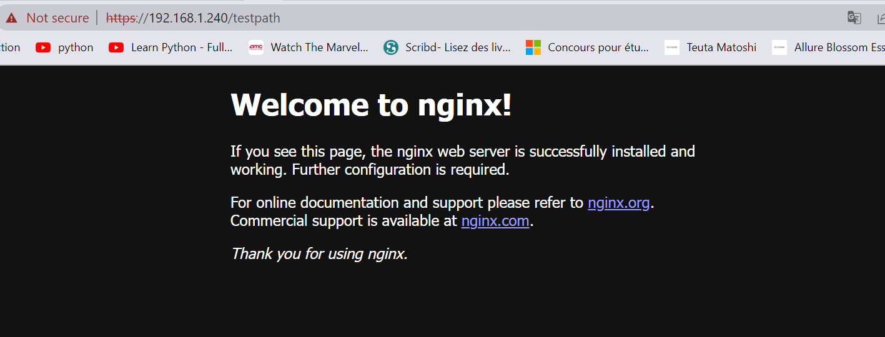

## Helm demo
*This demo will user the ingress on bare-metal using the Nginx Ingress Controller and metalLB.*

In my `helm-demo` folder, I have the `templates` directory and the `Chart` and `values` YAML files :
```bash
justk8s-master@master:~/helm-demo$ ls
Chart.yaml  templates  values.yaml
```
Inside the Chart.yaml file :
```YAML
name: my-first-demo
version: 1.0.0
description: easy helm demo
maintainers:
- name: Siwar
```
This is the metadata to describe each deployment.

Now inside the templates directory :
```bash
justk8s-master@master:~/helm-demo/templates$ ls
deployment.yaml  ingress.yaml  service.yaml
```
The depoyment.yaml file contains a simple nginx deployment :
```YAML
apiVersion: apps/v1
kind: Deployment
metadata: 
  name: my-nginx-deployment
spec:
  selector:
    matchLabels:
      app: nginx
  replicas: 3
  template:
    metadata:
      labels:
        app: nginx
    spec:
      containers:
      - name: nginx
        image: nginx:1.14.2
        ports:
        - containerPort: 80

```
And the service.yaml file :
``` YAML
apiVersion: v1
kind: Service
metadata: 
  name: my-nginx-service
spec:
  selector:
    app: nginx
  ports:
  - name: main
    protocol: TCP
    port: 80
```
And the ingress.yaml :
```YAML
apiVersion: networking.k8s.io/v1
kind: Ingress
metadata:
  name: my-nginx-ingress
  annotations:
    nginx.ingress.kubernetes.io/rewrite-target: /
    http.port: "443"
spec:
  ingressClassName: nginx
  rules:
  - http:
      paths:
      - path: /testpath
        pathType: Prefix
        backend:
          service:
            name: my-nginx-service
            port:
              number: 80

```
We're exposing port 443 on our ingress.

Next is `helm install`:
```bash 
justk8s-master@master:~$ helm install --generate-name helm-demo/
NAME: helm-demo-1660310990
LAST DEPLOYED: Fri Aug 12 06:29:50 2022
NAMESPACE: default
STATUS: deployed
REVISION: 1
TEST SUITE: None
```
So now with Helm and thanks to only one command line tool `helm install`, we were able to deploy our app very easily and very fast.
```bash
justk8s-master@master:~$ kubectl get all
NAME                                      READY   STATUS              RESTARTS   AGE
pod/my-nginx-deployment-9456bbbf9-c74rs   0/1     ContainerCreating   0          11s
pod/my-nginx-deployment-9456bbbf9-k4cdb   0/1     ContainerCreating   0          11s
pod/my-nginx-deployment-9456bbbf9-mm7dm   0/1     ContainerCreating   0          11s

NAME                       TYPE        CLUSTER-IP       EXTERNAL-IP   PORT(S)   AGE
service/kubernetes         ClusterIP   10.96.0.1        <none>        443/TCP   22m
service/my-nginx-service   ClusterIP   10.100.146.193   <none>        80/TCP    11s

NAME                                  READY   UP-TO-DATE   AVAILABLE   AGE
deployment.apps/my-nginx-deployment   0/3     3            0           11s

NAME                                            DESIRED   CURRENT   READY   AGE
replicaset.apps/my-nginx-deployment-9456bbbf9   3         3         0       11s
```
We can check our app running in the browser using the ingress ip `192.168.1.240` and specifying the path `/testpath`:



The usual way to do this with kubectl is by executing the `kubectl apply` command line for every resource.

