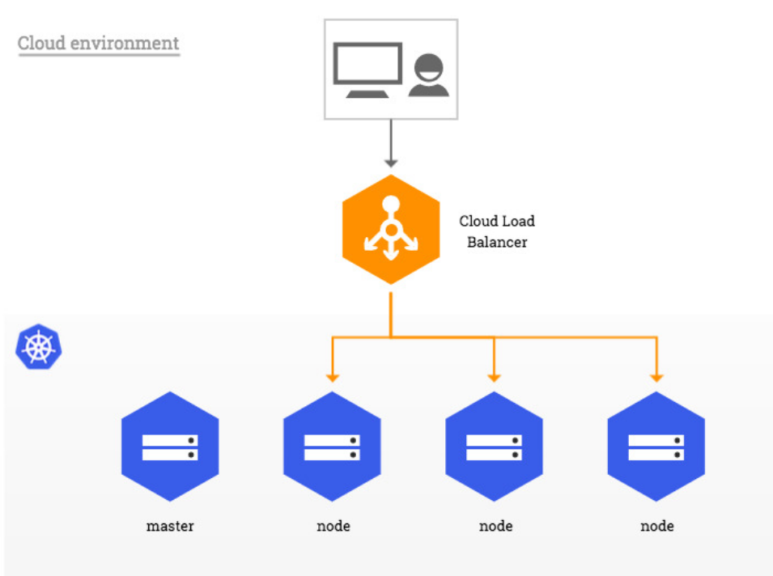
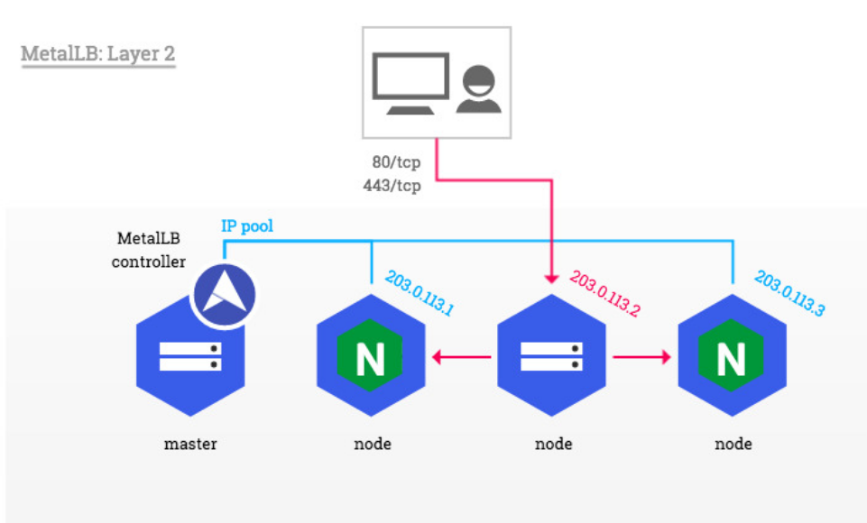

## Ingress
In Kubernetes, Ingress is used to configure routing rules to different services of your application. This also offers a public user-friendly URL for the end-users.

But the Ingress is just routing rules, Kubernetes requires an Ingress Controller that grabs these routing rules and configures the Load Balancer dynamically in your K8s cluster.

In cloud environments like AWS, Azure, GCP, etc., the Ingress Controller is supplied by the cloud provider.

In bare-metal K8s cluster, unless we deploy an Ingress Controller into our Kubernetes cluster, the Ingress will not work.

## Bare metal considerations
In traditional cloud environments, where network load balancers are available on-demand, a single Kubernetes manifest suffices to provide a single point of contact to the NGINX Ingress controller to external clients and, indirectly, to any application running inside the cluster. Bare-metal environments lack this commodity, requiring a slightly different setup to offer the same kind of access to external consumers.




## A pure software solution: MetalLB
MetalLB provides a network load-balancer implementation for Kubernetes clusters that do not run on a supported cloud provider, effectively allowing the usage of LoadBalancer Services within any cluster.

This figure demonstrates how to use the Layer 2 configuration mode of MetalLB together with the NGINX Ingress controller in a Kubernetes cluster that has publicly accessible nodes. In this mode, one node attracts all the traffic for the ingress-nginx Service IP.



*Reference : [Nginx Ingress Controller](https://kubernetes.github.io/ingress-nginx/deploy/baremetal/)*

## Installing MetalLB 
MetalLB can be deployed either with a simple Kubernetes manifest or with Helm.

### Installation With Manifest 

```bash
justk8s-master@master:~$ kubectl apply -f https://raw.githubusercontent.com/metallb/metallb/v0.12.1/manifests/namespace.yaml
justk8s-master@master:~$ kubectl apply -f https://raw.githubusercontent.com/metallb/metallb/v0.12.1/manifests/metallb.yaml

```

Now we must configure the metalLB using configmap object. In this configmap we give the address pool that will be used as LoadBalancer IP! Also the type of the Load Balancer (metalLB supports two LoadBalancing modes : Layer 2 mode and BGP mode. In our case we will use the Layer 2 mode).

Create the ConfigMap manifest containing metalLB configuration:
```YAML 
apiVersion: v1
kind: ConfigMap
metadata:
  namespace: metallb-system
  name: config
data:
  config: |
    address-pools:
    - name: default
      protocol: layer2
      addresses:
      - 192.168.1.240-192.168.1.250
```
And then apply it :
```bash 
justk8s-master@master:~$ kubectl apply -f metallb-configmap.yaml
configmap/config created
```

Reference : *[Installation Guide](https://metallb.universe.tf/installation/)*

## Install NGINX Ingress Controller
There are multiple ways to install the NGINX ingress controller:

- with Helm, using the project repository chart;
- with kubectl apply, using YAML manifests;
- with specific addons (e.g. for minikube or MicroK8s).

### Using the YAML manifest file
```bash
justk8s-master@master:~$ kubectl apply -f https://raw.githubusercontent.com/kubernetes/ingress-nginx/controller-v1.2.0/deploy/static/provider/cloud/deploy.yaml
namespace/ingress-nginx unchanged
serviceaccount/ingress-nginx configured
serviceaccount/ingress-nginx-admission configured
role.rbac.authorization.k8s.io/ingress-nginx configured
role.rbac.authorization.k8s.io/ingress-nginx-admission configured
clusterrole.rbac.authorization.k8s.io/ingress-nginx configured
clusterrole.rbac.authorization.k8s.io/ingress-nginx-admission configured
rolebinding.rbac.authorization.k8s.io/ingress-nginx configured
rolebinding.rbac.authorization.k8s.io/ingress-nginx-admission configured
clusterrolebinding.rbac.authorization.k8s.io/ingress-nginx configured
clusterrolebinding.rbac.authorization.k8s.io/ingress-nginx-admission configured
configmap/ingress-nginx-controller configured
service/ingress-nginx-controller created
service/ingress-nginx-controller-admission created
deployment.apps/ingress-nginx-controller created
job.batch/ingress-nginx-admission-create created
job.batch/ingress-nginx-admission-patch created
ingressclass.networking.k8s.io/nginx configured
validatingwebhookconfiguration.admissionregistration.k8s.io/ingress-nginx-admission configured
```
